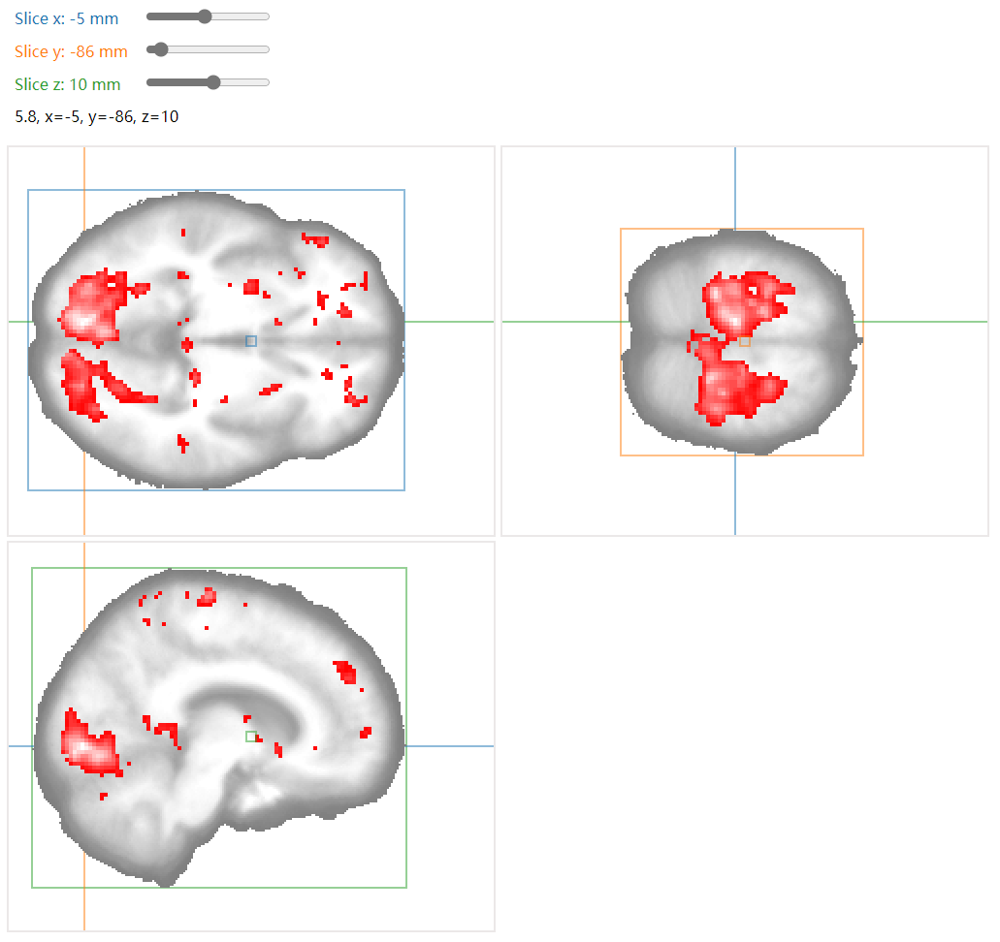

# Very stable and pretty results

- [Very stable and pretty results](#very-stable-and-pretty-results)
  - [MRI watcher on the web](#mri-watcher-on-the-web)
- [Vedo 的体积点云计算](#vedo-的体积点云计算)
  - [Vedo 与致密点云](#vedo-与致密点云)
  - [大脑 MRI 的分层表面](#大脑-mri-的分层表面)
- [不同源的 MRI 数据点阵匹配](#不同源的-mri-数据点阵匹配)
  - [MRI 数据的点阵与源空间](#mri-数据的点阵与源空间)
  - [点阵匹配快速算法](#点阵匹配快速算法)
  - [实现代码](#实现代码)


## MRI watcher on the web




---
# Vedo 的体积点云计算

Vedo 是很好用的 3D 点云操作工具，本文使用该工具进行体积点云的初步计算。

---

## Vedo 与致密点云

Vedo 是很好用的 3D 点云操作工具，本文使用该工具进行体积点云的初步计算。

[https://github.com/marcomusy/vedo](https://github.com/marcomusy/vedo)

致密点云与日常看到的表面点云具有较大的区别，最直观的区别就是表面点云是在物体的表面进行采样，而体积点云却是在物体的体积上进行采样，在医学影像数据中，CT、MRI等都是利用类似断层扫描的方法对身体部位进行无创的立体建模，它的每个点代表三维空间坐标下的生理指标。这些生理指标往往与病灶或器官外缘有关，因此对致密点云进行分析和建模，让它能够准确地反映病灶或器官的形态是医学影像的重要课题。

Vedo 是一种可用的工具，它可以从体积点云中找到连续等值曲面。由于它是一款开源软件，因此它的文档虽然完备，但功能基本靠猜，为了避免以后猜不透，现将它的计算逻辑简要记录如下


- 首先，它从点云中计算曲面的方法比较直观，调用 isosurface 方法即可；
- 其次，在调用该方法时，可以通过指定分割值的方法来寻找不同的等值面；
- 最后，每个顶点的值均保存在 mesh.pointdata[’input_scalars’]之中。

```python
# ------------------------------------------------
# Compute the hull mesh
vol = Volume(array_3d)
mesh = vol.isosurface(np.linspace(np.min(array_3d), np.max(array_3d), 5))
mesh.apply_transform(affine, reset=True)

'''
Explain of isosurface
(method) def isosurface(
    value: Any | None = None,
    flying_edges: bool = True
) -> Any
'''

# The pointdata contains the keys of ['Normals', 'input_scalars']
print([e for e in mesh.pointdata.keys()])

# The input_scalars
# (array([ 29.5,  29.5,  29.5, ..., 118. , 118. , 118. ]),
# (538288,),
# array([ 29.5,  59. ,  88.5, 118. ]))
d = mesh.pointdata['input_scalars']
display(d, d.shape, np.unique(d))

# The vertices and cells
# ((538288, 3), (1076000, 3))
vertices = np.array(mesh.vertices())
cells = np.array(mesh.cells())
display(vertices.shape, cells.shape)
```

## 大脑 MRI 的分层表面

用以上方法从大脑 MRI 数据中对等值面进行建模，得到的结果如下，它可以看作是大脑皮层结构的剖面图：


---
# 不同源的 MRI 数据点阵匹配

假设我们已经通过技术手段完成了 MRI 数据到标准模板的头动校正，但这并不能保证新数据与标准模板是同源的。为了解决该问题本文介绍快速配准的算法原理，该方法能够对不同源的 MRI 数据点阵进行匹配。

---

## MRI 数据的点阵与源空间

MRI 数据是无创的、由面片扫描得到的点阵数据，它总可以表示成三维实矩阵的形式

$$
F_{MRI} \in R^{I \times J \times K}
$$

其中，$i, j, k \in [0, 1, 2, 3 \dots ]$分别代表三维空间中的位置标号。另一方面点阵中的点具有各自的物理坐标。物理坐标需要零点，因此我们假定大脑中心有一点，即前联合点，将该点的坐标规定为 $(0, 0, 0)$，那么点阵中的每个点的空间标号与空间坐标满足一一对应关系

$$
F_{i, j, k} = G_{x, y, z}
$$

其中，$x, y, z \in (-l, l)$代表物理坐标。为了表达方便，我们将物理坐标所在的空间称为源空间。由此可见，为了将 MRI 点阵与其物理位置对应起来，就需要描述出点阵标号与源空间坐标之间的对应关系，在实际操作中，一般使用仿射变换矩阵进行该计算。仿射变换矩阵为 4 维方阵，该方阵满足变换关系

$$
[x, y, z, 1]^T =
\begin{bmatrix}
a_{11} & a_{12}& a_{13}& 0 \\
a_{21}& a_{22}& a_{33}& 0 \\
a_{21}& a_{32}& a_{33}& 0 \\
0& 0& 0& 1 \\
\end{bmatrix} \cdot
[i, j, k, 1]^T
$$

我们将物理坐标和位置标号的增广向量进行简计后可得

$$
X = A \cdot K
$$

该式为点阵匹配的快速算法的原理式。

## 点阵匹配快速算法

所谓点阵匹配，是对于点阵中的某个点，推出另一个点阵中对应点的匹配方法。

在论述快速算法之前，先啰嗦一下为何不能逐点匹配。简单来说是因为太慢，展开来说是因为实际采集到的 MRI 数据往往千奇百怪。以常用的标准模板为例，它的空间分辨率是 $1mm^3$，而 3T 设备采集的 MRI 数据往往只能达到 $\sim a \times b \times c mm^3$ 的空间分辨率，其中$a, b, c\in (2, 3)$。并且标准模板的点阵采样方向一般与物理坐标的方向对齐，但实际采集的 MRI 数据的点阵往往是倾斜的。这导致配准过程需要对每个采样点均进行分析，因此其时间复杂度为 $log(n)$，而这在 $256 \times 256 \times 256$ 规模的大点阵上显然是不可接受的。

[MNI MRI Template](https://neuroconductor.org/help/MNITemplate/)

因此，我们考虑用快速算法的原理式加速这一过程，首先考虑两个源的 MRI 数据

$$
\begin{cases}
X_1 = A_1 \cdot K_1 \\
X_2 = A_2 \cdot K_2
\end{cases}
$$

其中，$K_1, K_2$分别用于在点阵中检索出对应点的数值。我们将第一个 MRI 数据作为模板数据，第二个数据向它进行匹配。这个过程可以转化为解方程组

$$
\begin{cases}
X_1 = A_1 \cdot K_1 \\
X_1 = A_2 \cdot K_2'
\end{cases}
$$

解得

$$
K_2'=A_2^{-1} \cdot A_1 \cdot K_1
$$

其中，$K_1, K_2$为位置标号构成的增广矩阵

$$
K_1, K_2\in R^{4 \times N}
$$

最后，由于求出的$K_2$矩阵可能超出其占阵的界限，因此需要进行超界处理即可。上述矩阵计算的方法在 $256 \times 256 \times 256$ 规模的大点阵上，可以在毫秒量级内完成。

## 实现代码

下述代码可以完成上述工作

```python
def fill_from(self, img):
      '''
      Fill the array_3d like array with the other img.
      The coming img may have different affine coordinates and dimensions.
      '''
      # Prepare the filled array_3d
      filled = self.array_3d.copy() * 0
      xyz11 = self.xyz1
      ijk11 = self.ijk1

      # Read the img
      m2 = img.array_3d.copy()
      m2[0, :, :] = 0
      m2[:, 0, :] = 0
      m2[:, :, 0] = 0

      affine2 = img.affine
      affine2_inv = np.linalg.inv(affine2)

      # Compute the ijk of the img,
      # and remove the unavailable points indexes
      ijk12 = np.matmul(affine2_inv, xyz11).astype(np.int32)

      for j in range(3):
          top = img.shape[j] - 1
          ijk12[j][ijk12[j] < 0] = 0
          ijk12[j][ijk12[j] > top] = 0

      # Fill the filled
      filled[ijk11[0], ijk11[1], ijk11[2]] = m2[ijk12[0], ijk12[1], ijk12[2]]

      self.filled_array_3d = filled
      self.df['filled_value'] = filled.ravel()

      LOGGER.debug('Fill {} -> {}, src img:{}, dst img: {}'.format(
          img.shape,
          filled.shape,
          img.path,
          self.path,
      ))

      return filled
```